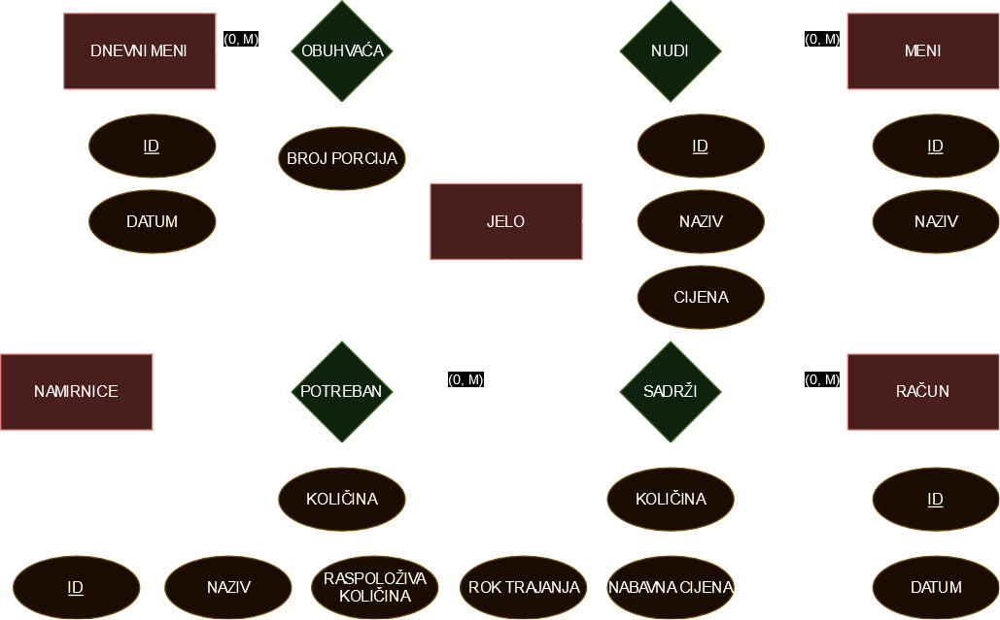
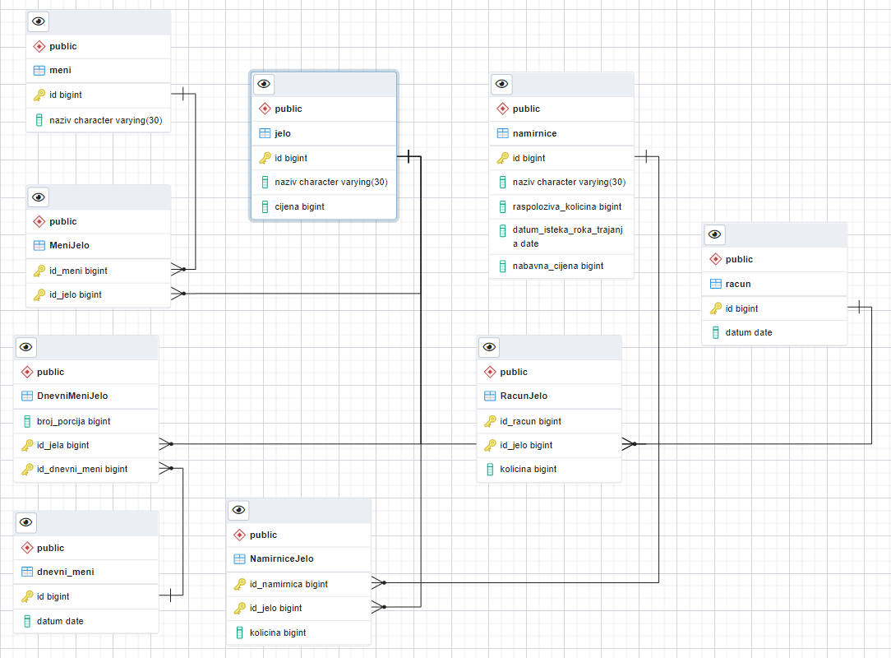

# Modeliranje baze podataka restorana

💡 Seminarski rad u sklopu kolegija Baze podataka na FESB-u.

### [Seminarski rad](https://fesb-my.sharepoint.com/:w:/g/personal/dceko00_fesb_hr/EUcniX-6FRBPtlwYweTi7MQBtMy_lDy69spQhsgD9Top9w?rtime=iLA7pKQm2Ug)

## Zadani Zahtjevi

- **Izvještaj o sastojcima za jela**  
  Prikazuje sastojke potrebne za pripremu pojedinog jela i njihovu trenutnu raspoloživost.

- **Izvještaj o potrebnim sastojcima**  
  Prikazuje sastojke koji će biti potrebni za nabavku unutar zadanog vremenskog perioda. Ovo uključuje namirnice koje istječu u roku od tjedan dana ili čija količina pada ispod određene minimalne vrijednosti (novi atribut: minimalna količina).

- **Izvještaj o jelima s određenim sastojkom**  
  Prikazuje sve recepte u kojima se koristi određena namirnica.

- **Popis nedostajućih namirnica za jela**  
  Prikazuje sve namirnice koje nisu u dovoljnoj količini za pripremu određenog jela.

- **Popis jela koje je moguće pripremiti**  
  Prikazuje jela koja se mogu pripremiti s raspoloživim namirnicama. Ovo se ostvaruje pronalaženjem svih jela koja se ne mogu pripremiti zbog nedostatka sastojaka i isključivanjem tih jela s popisa mogućih jela.

- **Pregled jela pripremljenih u određenom vremenskom periodu**  
  Prikazuje sva jela koja su pripremljena unutar zadanog vremenskog perioda.

## ER Diagram

  

## Specifikacija

### RELACIJA jelo
- **id**  
  Identifikator jela
- **naziv**  
  Naziv jela
- **cijena**  
  Cijena koju plaća mušterija kad naručuje to jelo – pozitivni realni broj

### RELACIJA namirnice
- **id**  
  Identifikator namirnice
- **naziv**  
  Naziv namirnice
- **raspoloživa_količina**  
  Preostala količina u kilogramima ili litrama ako se radi o tekućini – pozitivni realni broj
- **datum_isteka_roka_trajanja**  
  Datum isteka roka trajanja
- **nabavna_cijena**  
  Cijena po kojoj je kupljen proizvod po kilogramu ili litri – pozitivni realni broj

### RELACIJA meni
- **id**  
  Identifikator menija
- **naziv**  
  Naziv menija – jedan meni se sastoji od više slijedova jela (npr. juhe, pizze)

### RELACIJA račun
- **id**  
  Identifikator računa
- **datum**  
  Datum izdavanja računa

### RELACIJA dnevni_meni
- **id**  
  Identifikator dnevnog menija
- **datum**  
  Datum dnevnog menija

## PostgreSQL Schema

  

## SQL Kod

[Preuzmi SQL kod](schema.sql)